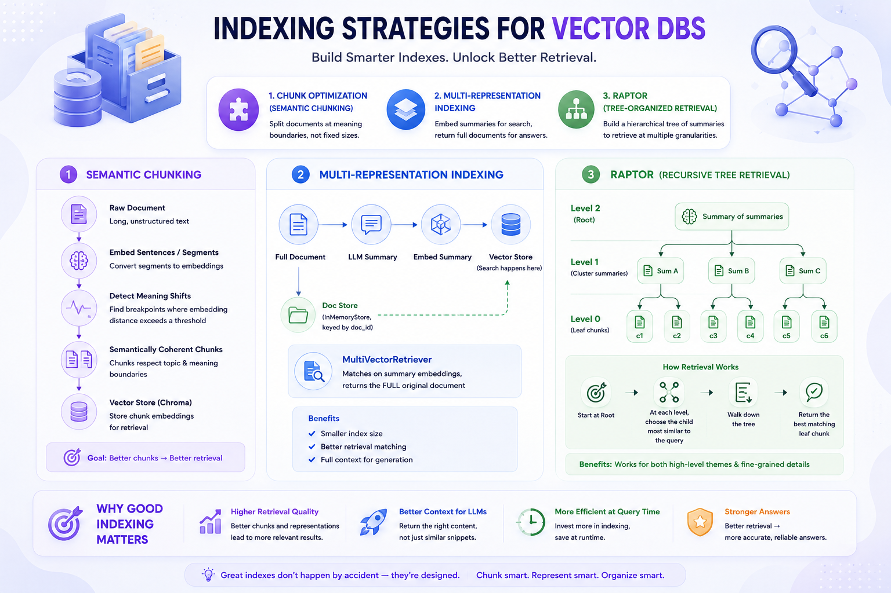

# 🗂️ Indexing Strategies for Vector DBs



Part of the [**Advance-RAG-Technics**](https://github.com/paras160500/Advance-RAG-Technics) series. This module moves one step earlier than retrieval/routing — it focuses on **how documents are chunked, represented, and organized inside the vector store itself**, since the quality of an index puts a hard ceiling on how good retrieval can ever be.

---

## 🚀 Techniques Covered

| # | Technique | Idea | Best For |
|---|-----------|------|----------|
| 1 | **Chunk Optimization (Semantic Chunking)** | Split documents at points where *meaning* changes (embedding-distance breakpoints) instead of fixed character counts | Long, topically varied documents where naive fixed-size chunks cut sentences/ideas in half |
| 2 | **Multi-Representation Indexing** | Embed a short **summary** of each document for retrieval, but return the **full original document** to the LLM for generation | Long source documents where you want precise retrieval matching but full context for the answer |
| 3 | **RAPTOR** (Recursive Abstractive Processing for Tree-Organized Retrieval) | Recursively cluster and summarize chunks into a **tree** — leaves are raw chunks, higher nodes are summaries of summaries — then retrieve by walking down the tree toward the most relevant branch | Large corpora needing both fine-grained detail *and* high-level thematic answers |

---

## 🏗️ Architecture

### 1. Semantic Chunking

```
Raw Document
     │
     ▼
Embed sentences/segments
     │
     ▼
Find breakpoints where embedding distance
exceeds a percentile threshold
     │
     ▼
Semantically coherent chunks
     │
     ▼
Vector Store (Chroma)
```

### 2. Multi-Representation Indexing

```
Full Document ──► LLM Summary ──► Embed Summary ──► Vector Store
      │                                                  │
      │                                    (search happens here)
      ▼                                                  │
  Doc Store (InMemoryStore, keyed by doc_id) ◄────────────┘
      │
      ▼
MultiVectorRetriever returns the FULL document, not the summary
```

### 3. RAPTOR Tree

```
Level 2 (Root)              [ Summary of summaries ]
                                    │
Level 1 (Cluster summaries)   [Sum A]   [Sum B]   [Sum C]
                              /    \    /    \    /    \
Level 0 (Leaf chunks)      [c1]  [c2] [c3]  [c4] [c5]  [c6]

Retrieval: start at root → cosine-similarity walk down
the best-matching child at each level → return the leaf chunk
```

---

## 📦 Installation

```bash
pip install langchain langchain-community langchain-core langchain-classic
pip install langchain-experimental langchain-ollama langchain-text-splitters
pip install chromadb python-dotenv langsmith
pip install openai sentence-transformers scikit-learn numpy
```

### 🧠 Install Ollama (local LLM)

Download from [ollama.com](https://ollama.com), then pull the models used in the notebook:

```bash
ollama pull llama3.2:3b
ollama pull nomic-embed-text
```

### 🔑 Environment Variables

Create a `.env` file in this folder with:

```env
LANGCHAIN_TRACING_V2=true
LANGCHAIN_ENDPOINT=https://api.smith.langchain.com
LANGCHAIN_API_KEY=your_langsmith_api_key
OPENAI_API_KEY=your_openai_api_key
```

> `OPENAI_API_KEY` is **required** for the RAPTOR section (uses `gpt-4o-mini` for summarization). The chunking and multi-representation sections run fully on local Ollama models.

---

## 🧪 How It Works

The notebook (`main.ipynb`) walks through three increasingly sophisticated indexing strategies.

### 1. Chunk Optimization — Semantic Chunking

Instead of `RecursiveCharacterTextSplitter`'s fixed-size windows, `SemanticChunker` embeds the text and splits at points where consecutive segments diverge semantically — one line of code swaps naive splitting for meaning-aware splitting:

```python
text_splitter = SemanticChunker(
    embeddings,
    breakpoint_threshold_type="percentile"
)

chunks = text_splitter.split_documents(docs)

vectorstore = Chroma.from_documents(
    documents=chunks, embedding=embeddings, collection_name="chunk-demo"
)

results = vectorstore.similarity_search("How does memory work in AI agents?", k=2)
```

### 2. Multi-Representation Indexing

Each full document is summarized by an LLM, and **only the summary is embedded and searched** — the vector store stays small and the embeddings stay focused on the gist of each document:

```python
chain = (
    {"doc": lambda x: x.page_content}
    | ChatPromptTemplate.from_template("Summarize the following document:\n\n{doc}")
    | llm | StrOutputParser()
)

summaries = chain.batch(docs, {"max_concurrency": 5})
```

A `MultiVectorRetriever` links each summary back to its full source document via a shared `doc_id`, so a similarity hit on the *summary* still returns the *entire original document* for generation:

```python
retriever = MultiVectorRetriever(
    vectorstore=vectorstore,   # holds summary embeddings
    docstore=store,            # holds full original documents
    id_key="doc_id",
)

retriever.vectorstore.add_documents(summary_docs)
retriever.docstore.mset(list(zip(doc_ids, docs)))

retrieved_docs = retriever.invoke("Memory in agents")
# retrieved_docs[0] is the FULL document, even though search matched a short summary
```

### 3. RAPTOR — Recursive Abstractive Tree Retrieval

Raw chunks become **leaf nodes**, each holding its own embedding:

```python
class Node:
    def __init__(self, text, children=None):
        self.text = text
        self.children = children if children else []
        self.embedding = embedding_model.encode(text)

    def is_leaf(self):
        return len(self.children) == 0
```

`build_tree` recursively **clusters** nodes with KMeans, **summarizes** each cluster with an LLM, and wraps the summary in a new parent node — repeating until only one root node remains:

```python
def build_tree(nodes):
    if len(nodes) == 1:
        return nodes[0]

    n_clusters = max(1, len(nodes) // 2)
    kmeans = KMeans(n_clusters=n_clusters, random_state=42, n_init="auto")
    labels = kmeans.fit_predict(np.array([n.embedding for n in nodes]))

    new_nodes = []
    for cluster_id in range(n_clusters):
        cluster_nodes = [n for i, n in enumerate(nodes) if labels[i] == cluster_id]
        combined_text = "\n".join(n.text for n in cluster_nodes)
        summary = summarize(combined_text)          # LLM call (gpt-4o-mini)
        new_nodes.append(Node(summary, cluster_nodes))

    return build_tree(new_nodes)
```

`retrieve` then walks the tree top-down, at each level picking the child whose embedding is most cosine-similar to the query, until it reaches a leaf:

```python
def retrieve(query, node):
    if node.is_leaf():
        return node

    query_embedding = embedding_model.encode(query)
    scores = [cosine_similarity([query_embedding], [c.embedding])[0][0] for c in node.children]
    best_child = node.children[np.argmax(scores)]
    return retrieve(query, best_child)
```

The demo builds a small tree from six toy sentences about transformers/CNNs, then retrieves the most relevant leaf for *"Explain multi head attention"*.

---

## ⚡ Tech Stack

- LangChain (Core, Community, Experimental, Classic, Text Splitters)
- Ollama — `llama3.2:3b` (LLM) / `nomic-embed-text` (embeddings)
- ChromaDB (vector store)
- OpenAI — `gpt-4o-mini` (RAPTOR cluster summarization)
- Sentence-Transformers — `all-MiniLM-L6-v2` (RAPTOR embeddings)
- scikit-learn (`KMeans`, `cosine_similarity`)
- NumPy
- LangSmith (optional tracing)

---

## 🧠 Key Learnings

- **Chunking strategy is itself a retrieval lever** — semantic chunking can prevent splitting a coherent idea across two chunks, which fixed-size splitting does regularly.
- **What you embed doesn't have to be what you return.** Multi-representation indexing decouples the *searchable surface* (a summary) from the *content surface* (the full document), giving precise retrieval without truncating context.
- **Indexes don't have to be flat.** RAPTOR's tree structure lets a single index answer both granular questions (via leaf chunks) and thematic/high-level questions (via cluster summaries near the root) — something a single flat embedding index can't do well on its own.
- All three techniques trade extra **preprocessing cost** (embeddings for breakpoints, LLM summarization calls, recursive clustering) for **better retrieval quality** at query time — a recurring theme in advanced RAG.

---

## 🚀 Future Improvements

- Benchmark semantic vs. fixed-size chunking on retrieval precision/recall for the same corpus
- Persist the RAPTOR tree (and its node embeddings) instead of rebuilding it in memory each run
- Combine RAPTOR with multi-representation indexing: embed cluster summaries in a vector store and retrieve nodes directly, instead of a pure top-down walk
- Replace the toy RAPTOR corpus with the same Lilian Weng blog posts used elsewhere in this repo, for an apples-to-apples comparison

---

## 👨‍💻 Author

Built for learning: Indexing strategies for RAG + LangChain + Local LLMs