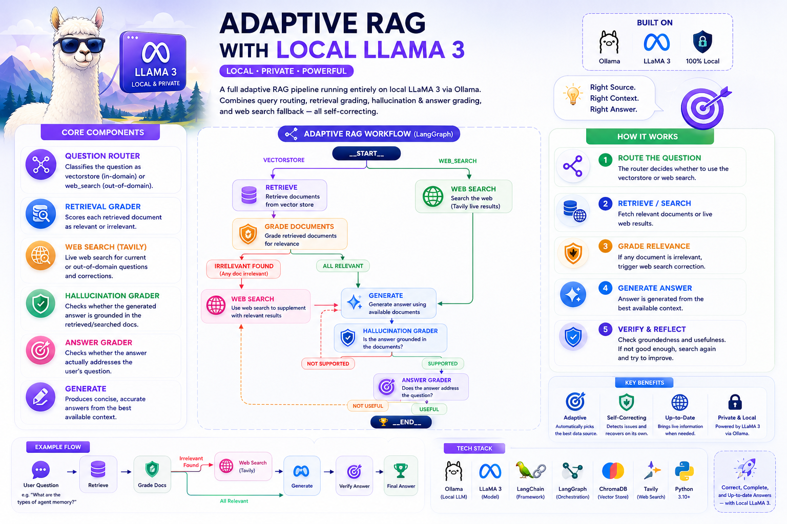
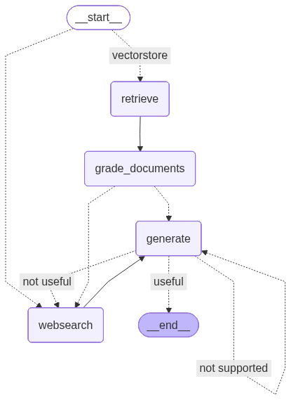

# 🦙 Adaptive RAG with Local LLaMA 3



Part of the [**Advance-RAG-Technics**](https://github.com/paras160500/Advance-RAG-Technics) series. This module rebuilds the **Adaptive RAG** pipeline from [`8_Adaptive_Rag_Agent`](../8_Adaptive_Rag_Agent) — query routing + retrieval grading + hallucination/answer grading + web-search fallback — running **entirely on a local LLaMA 3 model via Ollama** instead of OpenAI's `gpt-4o-mini`.

The graph logic is functionally identical to the OpenAI-based Adaptive RAG module; what changes is *how* structured decisions are extracted from the LLM: raw **LLaMA 3 prompt-template tokens** + `JsonOutputParser`, instead of Pydantic `with_structured_output()`.

---

## 🚀 Core Idea

Same six-component design as Adaptive RAG, reimplemented for a local, open-weight model:

| Component | Role |
|---|---|
| **Question Router** | Classifies the question as `vectorstore` or `web_search` |
| **Retrieval Grader** | Scores each retrieved document relevant/irrelevant; any irrelevant doc sets a `web_search` flag |
| **Web Search Tool** (Tavily) | Live web search, used either as the routed destination or as a correction step |
| **Hallucination Grader** | Checks the generation is grounded in the retrieved/searched documents |
| **Answer Grader** | Checks the generation actually addresses the question |
| **Generate** | Produces a concise (max 3-sentence) answer from context |

---

## 🏗️ Architecture



```
                  __start__
                 /          \
          vectorstore      websearch
              │                 │
              ▼                 │
          retrieve               │
              │                 │
              ▼                 │
      grade_documents            │
        │           │           │
    websearch    generate ◄──────┘
   (irrelevant       │   \    \
    docs found)       │ not    not
        │             │ supported useful
        └────►websearch│   │       │
                 ▲      └──┘       │
                 └──────────────────┘
                       │
                       ▼
                generate ──useful──► __end__
```

Same shape as the OpenAI Adaptive RAG graph: a **conditional entry point** for routing, a **conditional edge** after grading (generate vs. websearch), and a **conditional edge** after generation (useful / not useful / not supported) — just swapped onto a local model.

---

## 📦 Installation

```bash
pip install langchain langchain-community langchain-core langchain-openai
pip install langchain-ollama langchain-text-splitters chromadb langgraph
pip install python-dotenv langsmith
pip install tavily-python
```

A consolidated [`requirements.txt`](../requirements.txt) covering the whole repo is also available at the project root.

### 🧠 Install Ollama (local LLM)

Download from [ollama.com](https://ollama.com), then pull the model used in the notebook:

```bash
ollama pull llama3
```

### 🔑 Environment Variables

Create a `.env` file in this folder with:

```env
OPENAI_API_KEY=your_openai_api_key
TAVILY_API_KEY=your_tavily_api_key
LANGCHAIN_TRACING_V2=true
LANGCHAIN_ENDPOINT=https://api.smith.langchain.com
LANGCHAIN_API_KEY=your_langsmith_api_key
```

> `OPENAI_API_KEY` is only used for `OpenAIEmbeddings` when building the vector store — all generation, grading, and routing run locally via `ChatOllama(model="llama3")`. `TAVILY_API_KEY` is **required** for the web search fallback.

---

## 🧪 How It Works

The notebook (`main.ipynb`) indexes the same three Lilian Weng blog posts used elsewhere in the series, then builds every LLM component using **raw LLaMA 3 chat-template syntax** instead of LangChain's higher-level structured-output API.

### 1. Index

```python
local_llm = 'llama3'

text_splitter = RecursiveCharacterTextSplitter.from_tiktoken_encoder(chunk_size=250, chunk_overlap=0)
doc_splits = text_splitter.split_documents(docs_list)
vectorstore = Chroma.from_documents(documents=doc_splits, collection_name="rag-chroma", embedding=OpenAIEmbeddings())
retriever = vectorstore.as_retriever()
```

### 2. Retrieval Grader — Raw LLaMA 3 Prompt Format

Rather than `with_structured_output()`, this notebook prompts the model directly using LLaMA 3's special tokens (`<|begin_of_text|>`, `<|start_header_id|>...<|end_header_id|>`, `<|eot_id|>`) and asks for raw JSON, parsed with `JsonOutputParser`:

```python
llm = ChatOllama(model=local_llm, format="json", temperature=0)

prompt = PromptTemplate(
    template="""<|begin_of_text|><|start_header_id|>system<|end_header_id|> You are a grader assessing relevance
    of a retrieved document to a user question. ... Give a binary score 'yes' or 'no' score ...
    Provide the binary score as a JSON with a single key 'score' and no premable or explaination.
     <|eot_id|><|start_header_id|>user<|end_header_id|>
    Here is the retrieved document: \n\n {document} \n\n
    Here is the user question: {question} \n <|eot_id|><|start_header_id|>assistant<|end_header_id|>
    """,
    input_variables=["question", "document"],
)

retrieval_grader = prompt | llm | JsonOutputParser()
```

### 3. Generate — Concise, Context-Only Answers

```python
prompt = PromptTemplate(
    template="""<|begin_of_text|><|start_header_id|>system<|end_header_id|> You are an assistant for question-answering tasks.
    Use the following pieces of retrieved context to answer the question. If you don't know the answer, just say that you don't know.
    Use three sentences maximum and keep the answer concise <|eot_id|><|start_header_id|>user<|end_header_id|>
    Question: {question}
    Context: {context}
    Answer: <|eot_id|><|start_header_id|>assistant<|end_header_id|>""",
    input_variables=["question", "document"],
)

llm = ChatOllama(model=local_llm, temperature=0)
rag_chain = prompt | llm | StrOutputParser()
```

### 4. Hallucination Grader & Answer Grader

Same JSON-graded pattern as the retrieval grader, checking groundedness and usefulness respectively:

```python
hallucination_grader = prompt | llm | JsonOutputParser()   # {"score": "yes"/"no"} vs. documents
answer_grader = prompt | llm | JsonOutputParser()          # {"score": "yes"/"no"} vs. question
```

### 5. Router

```python
llm = ChatOllama(model=local_llm, format="json", temperature=0)

prompt = PromptTemplate(
    template="""<|begin_of_text|><|start_header_id|>system<|end_header_id|> You are an expert at routing a
    user question to a vectorstore or web search. Use the vectorstore for questions on LLM agents,
    prompt engineering, and adversarial attacks. ... Give a binary choice 'web_search' or 'vectorstore' ...
    Return the a JSON with a single key 'datasource' and no premable or explaination.
    Question to route: {question} <|eot_id|><|start_header_id|>assistant<|end_header_id|>""",
    input_variables=["question"],
)

question_router = prompt | llm | JsonOutputParser()
```

### 6. Graph State & Nodes

```python
class GraphState(TypedDict):
    question: str
    generation: str
    web_search: str
    documents: List[str]
```

`retrieve`, `generate`, `grade_documents`, and `web_search` mirror the OpenAI Adaptive RAG module almost line-for-line, but pull scores out of plain dicts (`score['score']`, `source['datasource']`) instead of Pydantic model attributes:

```python
def grade_documents(state):
    filtered_docs, web_search = [], "No"
    for d in state["documents"]:
        score = retrieval_grader.invoke({"question": state["question"], "document": d.page_content})
        if score['score'].lower() == "yes":
            filtered_docs.append(d)
        else:
            web_search = "Yes"
    return {"documents": filtered_docs, "question": state["question"], "web_search": web_search}
```

### 7. Conditional Routing

```python
def route_question(state):
    source = question_router.invoke({"question": state["question"]})
    return "websearch" if source['datasource'] == 'web_search' else "vectorstore"

def decide_to_generate(state):
    return "websearch" if state["web_search"] == "Yes" else "generate"

def grade_generation_v_documents_and_question(state):
    grade = hallucination_grader.invoke({"documents": state["documents"], "generation": state["generation"]})['score']
    if grade == "yes":
        grade = answer_grader.invoke({"question": state["question"], "generation": state["generation"]})['score']
        return "useful" if grade == "yes" else "not useful"
    return "not supported"
```

### 8. Wiring the Graph

```python
workflow = StateGraph(GraphState)

workflow.add_node("websearch", web_search)
workflow.add_node("retrieve", retrieve)
workflow.add_node("grade_documents", grade_documents)
workflow.add_node("generate", generate)

workflow.set_conditional_entry_point(
    route_question, {"websearch": "websearch", "vectorstore": "retrieve"},
)
workflow.add_edge("retrieve", "grade_documents")
workflow.add_conditional_edges(
    "grade_documents", decide_to_generate, {"websearch": "websearch", "generate": "generate"},
)
workflow.add_edge("websearch", "generate")
workflow.add_conditional_edges(
    "generate", grade_generation_v_documents_and_question,
    {"not supported": "generate", "useful": END, "not useful": "websearch"},
)

app = workflow.compile()
```

Note the slight difference from module 8: here, when `generate`'s answer is graded **"not useful"**, the graph routes straight back to `websearch` (not `transform_query` → there's no question-rewriter in this notebook).

### 9. Running It

```python
inputs = {"question": "What are the types of agent memory?"}
for output in app.stream(inputs):
    for key, value in output.items():
        pprint(f"Finished running: {key}:")
pprint(value["generation"])
```

```python
inputs = {"question": "Who are the Bears expected to draft first in the NFL draft?"}
# ...same loop — this one routes to websearch instead of the vectorstore
```

---

## ⚡ Tech Stack

- LangChain (Core, Community, OpenAI, Text Splitters)
- **LangGraph** (`StateGraph`, conditional entry point, conditional edges, graph visualization)
- **Ollama / LLaMA 3** (`ChatOllama`) — router, both graders, hallucination/answer graders, and generator, all local
- `JsonOutputParser` (raw JSON parsing from LLaMA 3's chat-template output)
- OpenAI — `OpenAIEmbeddings` only (vector store embeddings)
- **Tavily Search** (web search routing/fallback)
- ChromaDB (vector store)
- LangSmith (optional tracing)

---

## 🧠 Key Learnings

- **The same adaptive-RAG graph topology works regardless of which model powers the decisions** — routing, grading, and generation are model-agnostic graph logic; only the *prompting and parsing strategy* changes between OpenAI's structured-output API and LLaMA 3's raw chat-template + JSON parsing.
- Open-weight chat models like LLaMA 3 need their **literal special tokens** (`<|begin_of_text|>`, `<|start_header_id|>`, `<|eot_id|>`) hand-written into the prompt to get reliable instruction-following — there's no equivalent to OpenAI's implicit message-formatting layer when prompting through Ollama's raw `ChatOllama` interface this way.
- `format="json"` on `ChatOllama` plus an explicit "no preamble or explanation" instruction is the local-model equivalent of structured output — it constrains the model to emit parseable JSON without a dedicated schema-enforcement API.
- This module is the direct, lower-cost-per-call counterpart to module 8: same self-correcting design, but every grading/routing/generation call runs on local hardware instead of hitting the OpenAI API.
- Skipping the question-rewriter (routing failed generations straight back to `websearch` instead of rewriting first) is a simpler, slightly less precise recovery path than modules 6, 8, and 9 — worth noting as a deliberate simplification in this version.

---

## 🚀 Future Improvements

- Add the question-rewriter node back in (as in modules 6, 8, 9) before falling back to `websearch` on a "not useful" generation
- Benchmark LLaMA 3 grading/routing accuracy vs. `gpt-4o-mini` on the same question set to quantify the local-vs-hosted trade-off
- Add a loop guard to prevent indefinite `generate ↔ websearch` cycling
- Try larger or instruction-tuned LLaMA 3 variants (e.g. `llama3:70b`, `llama3.1`) for improved grading reliability, where hardware allows

---

## 👨‍💻 Author

Built for learning: Adaptive RAG with LangGraph + LangChain + Local LLaMA 3 (Ollama) + Tavily