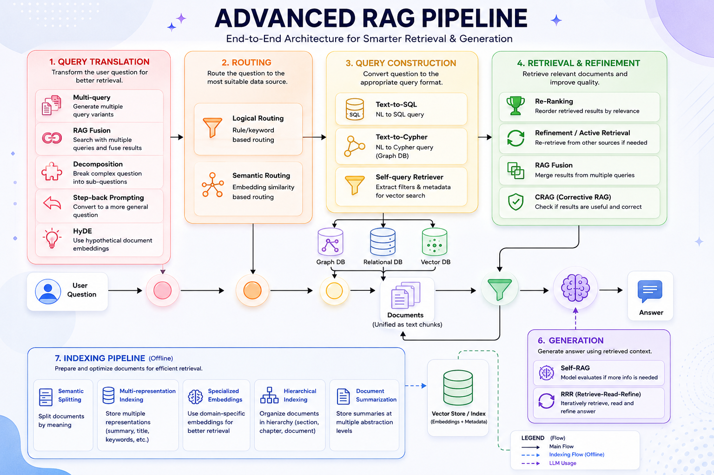

# 🧠 RAG System with LangChain + Ollama + ChromaDB



A simple yet powerful Retrieval-Augmented Generation (RAG) system built using LangChain, Ollama, and ChromaDB.

---

## 🚀 Features

- 🌐 Web data loading using WebBaseLoader
- ✂️ Text chunking with RecursiveCharacterTextSplitter
- 🔍 Embeddings using Ollama (`nomic-embed-text`)
- 🧠 Vector storage using ChromaDB
- 🤖 Local LLM using Llama 3.2 (3B)
- 🔗 LCEL-based RAG pipeline
- 📊 Token counting using tiktoken
- 📐 Cosine similarity for embeddings

---

## 🏗️ Architecture

```
User Query
   ↓
Retriever (ChromaDB)
   ↓
Relevant Documents
   ↓
Format Documents
   ↓
Prompt Template
   ↓
LLM (Llama 3.2 via Ollama)
   ↓
Final Answer
```

---

## 📦 Installation

### Install dependencies

```bash
pip install langchain langchain-community langchain-core langchain-ollama
pip install chromadb bs4 tiktoken numpy
```

### 🧠 Install Ollama

Download: [https://ollama.com](https://ollama.com)

Check version:

```bash
ollama --version
```

### 📥 Pull required models

```bash
ollama pull llama3.2:3b
ollama pull nomic-embed-text
```

---

## 🧪 How It Works

### 1. Load Web Data

Source: `https://lilianweng.github.io/posts/2023-06-23-agent/`

### 2. Split Text

```python
RecursiveCharacterTextSplitter(chunk_size=1000, chunk_overlap=200)
```

### 3. Create Embeddings

```python
OllamaEmbeddings(model="nomic-embed-text")
```

### 4. Store in Vector DB

```python
Chroma.from_documents(...)
```

### 5. Retrieve Documents

```python
vectorstore.as_retriever()
```

### 6. Run LLM

```python
ChatOllama(model="llama3.2:3b")
```

---

## 🔗 RAG Chain

```python
rag_chain = (
    {"context": retriever | format_doc,
     "question": RunnablePassthrough()}
    | prompt
    | llm
    | StrOutputParser()
)
```

---

## 💬 Example

```python
rag_chain.invoke("What is Task Decomposition?")
```

---

## 📊 Token Counter

```python
import tiktoken

def num_tokens_from_string(string, encoding_name):
    encoding = tiktoken.get_encoding(encoding_name)
    return len(encoding.encode(string))
```

---

## 🔢 Cosine Similarity

```python
import numpy as np

def cosine_similarity(vec1, vec2):
    return np.dot(vec1, vec2) / (np.linalg.norm(vec1) * np.linalg.norm(vec2))
```

---

## 🧠 Key Learnings

- RAG architecture
- Vector databases
- Embeddings
- Prompt engineering
- Local LLM usage
- LCEL pipeline design

---

## ⚡ Tech Stack

- LangChain
- Ollama
- ChromaDB
- NumPy
- tiktoken
- BeautifulSoup
- Llama 3.2 3B
- Nomic Embeddings

---

## 🚀 Future Improvements

- Add reranker model
- Hybrid search (BM25 + vector)
- FastAPI deployment
- Streaming responses
- Chat memory support

---

## 👨‍💻 Author

Built for learning: RAG + LangChain + Local LLMs