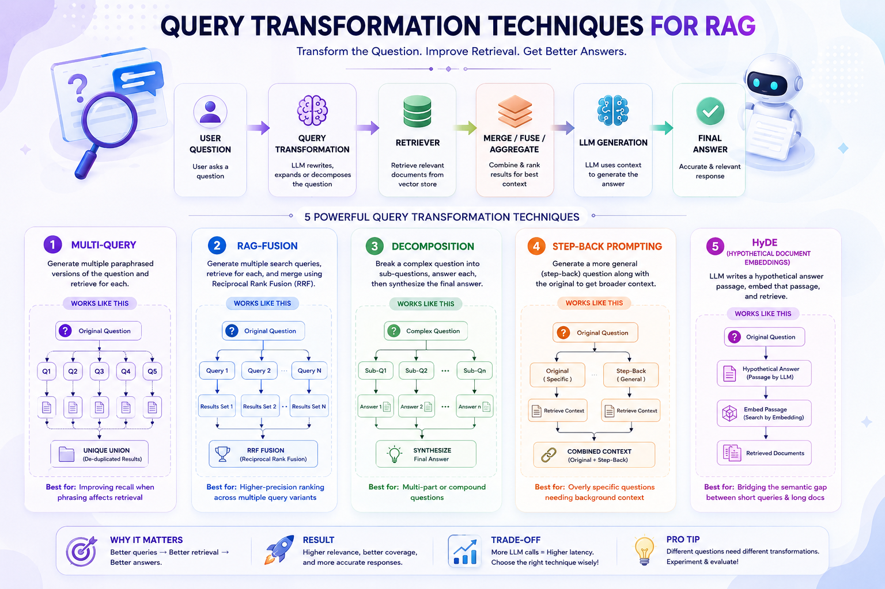

# 🔄 Query Transformation Techniques for RAG



Part of the [**Advance-RAG-Technics**](https://github.com/paras160500/Advance-RAG-Technics) series. This module covers **query transformation** — a family of techniques that rewrite, expand, or decompose a user's question *before* retrieval, so the retriever has a better chance of pulling back the right context.

Naive RAG embeds the raw user question and searches for similar chunks. That breaks down when the question is vague, overly specific, multi-part, or phrased very differently from the source documents. Query transformation fixes this by letting an LLM reformulate the question first.

---

## 🚀 Techniques Covered

| # | Technique | Idea | Best For |
|---|-----------|------|----------|
| 1 | **Multi-Query** | Generate 5 paraphrased versions of the question, retrieve for each, then take the unique union of results | Improving recall when phrasing affects retrieval |
| 2 | **RAG-Fusion** | Generate multiple search queries, retrieve for each, then merge with **Reciprocal Rank Fusion (RRF)** | Higher-precision ranking across multiple query variants |
| 3 | **Decomposition** | Break a complex question into 3 sub-questions, answer each (optionally carrying answers forward), then synthesize a final answer | Multi-part / compound questions |
| 4 | **Step-Back Prompting** | Generate a more general "step-back" question alongside the original, retrieve context for both | Overly narrow/specific questions that need background context |
| 5 | **HyDE** (Hypothetical Document Embeddings) | Ask the LLM to hallucinate a plausible answer passage, embed *that* instead of the question, then retrieve | Bridging the semantic gap between short queries and long-form documents |

---

## 🏗️ Architecture

```
User Question
     │
     ▼
┌─────────────────────────┐
│  Query Transformation    │   ← Multi-Query / RAG-Fusion / Decomposition /
│  (LLM rewrites query)    │      Step-Back / HyDE
└─────────────────────────┘
     │
     ▼
Retriever (Chroma vector store)
     │
     ▼
Merge / Fuse / Aggregate Context
     │
     ▼
Prompt + LLM (Ollama: llama3.2:3b)
     │
     ▼
Final Answer
```

---

## 📦 Installation

```bash
pip install langchain langchain-community langchain-core langchain-openai langchain-ollama
pip install langchain-text-splitters chromadb bs4 python-dotenv langsmith
```

### 🧠 Install Ollama (local LLM)

Download from [ollama.com](https://ollama.com), then pull the model used in the notebook:

```bash
ollama pull llama3.2:3b
```

### 🔑 Environment Variables

Create a `.env` file in this folder with:

```env
LANGCHAIN_TRACING_V2=true
LANGCHAIN_ENDPOINT=https://api.smith.langchain.com
LANGCHAIN_API_KEY=your_langsmith_api_key
OPENAI_API_KEY=your_openai_api_key
```

> `OPENAI_API_KEY` is only required if you swap in `OpenAIEmbeddings` / `ChatOpenAI` instead of the local Ollama models. `LANGCHAIN_*` vars enable optional LangSmith tracing.

---

## 🧪 How It Works

The notebook (`main.ipynb`) loads a single blog post — [*LLM Powered Autonomous Agents*](https://lilianweng.github.io/posts/2023-06-23-agent/) — chunks it, embeds it into a **Chroma** vector store, and then runs the **same underlying question** through each of the five transformation pipelines below.

### 1. Multi-Query

```python
template = """You are an AI language model assistant. Your task is to generate five
different versions of the given user question to retrieve relevant documents from a vector
database. ... Original question: {question}"""

generate_queries = prompt_perspectives | llm | StrOutputParser() | (lambda x: x.split("\n"))

retrieval_chain = generate_queries | retriever.map() | get_unique_union
docs = retrieval_chain.invoke({"question": question})
```

`get_unique_union` de-duplicates documents retrieved across all paraphrased queries using `langchain_core.load.dumps/loads`.

### 2. RAG-Fusion

```python
template = """You are a helpful assistant that generates multiple search queries based on a single input query.
Generate multiple search queries related to: {question}
Output (4 queries):"""

generate_queries = prompt_rag_fusion | llm | StrOutputParser() | (lambda x: x.split("\n"))
```

Results from each query are combined using **Reciprocal Rank Fusion**:

```python
def reciprocal_rank_fusion(results: list[list], k=60):
    """Combines ranked document lists into a single re-ranked list using RRF."""
    ...
```

### 3. Decomposition

```python
template = """You are a helpful assistant that generate multiple sub-questions related to an input question.
The goal is to break down the input into a set of sub-problems / sub questions that can be answered in isolation.
Generate multiple search queries related to: {question}
Output (3 queries):"""
```

Each sub-question is answered individually (optionally passing prior Q&A pairs forward for context), then all Q&A pairs are synthesized into one final, well-formatted answer.

### 4. Step-Back Prompting

Uses **few-shot examples** to teach the LLM how to generalize a specific question into a broader one:

```python
examples = [
    {"input": "Could the members of The Police perform lawful arrests?",
     "output": "what can the members of The Police do?"},
    {"input": "Jan Sindel's was born in what country?",
     "output": "what is Jan Sindel's personal history?"},
]
```

Both the **original** question and the **step-back** question are used to retrieve context, and both are passed to the final answer prompt.

### 5. HyDE (Hypothetical Document Embeddings)

```python
template = """Please write a scientific paper passage to answer the question
Question: {question}
Passage:"""

generate_docs_for_retrieval = prompt_hyde | llm | StrOutputParser()
retrieval_chain = generate_docs_for_retrieval | retriever
```

Instead of embedding the question, the LLM first writes a hypothetical answer passage — that passage is embedded and used to search the vector store, since it's semantically closer to real documents than a short question.

---

## ⚡ Tech Stack

- LangChain (Core, Community, Text Splitters)
- Ollama — `llama3.2:3b` (local LLM)
- ChromaDB (vector store)
- OpenAI Embeddings / Chat models (optional alternative backend)
- LangSmith (optional tracing)
- BeautifulSoup4 (web scraping for source documents)

---

## 🧠 Key Learnings

- Why naive single-query retrieval struggles with phrasing, scope, and compound questions
- How to generate and fuse multiple query variants (Multi-Query, RAG-Fusion)
- How to decompose complex questions and synthesize answers across sub-questions
- How step-back prompting retrieves broader background context
- How HyDE closes the semantic gap between queries and documents by embedding a hypothetical answer instead of the question
- Trade-offs: each added LLM call for query transformation increases **latency**, and not every technique improves **context precision/recall** for every type of question (see the [evaluation discussion](https://medium.com/@klaudial/advanced-rag-comprehensive-analysis-of-query-transformation-technics-part-2-43ccf3f04eaf) for a deeper look at Multi-Query's trade-offs)

---

## 🚀 Future Improvements

- Add quantitative evaluation (Ragas: faithfulness, context precision/recall, answer relevancy)
- Compare latency vs. quality across all five techniques on the same question set
- Add a query router to dynamically pick the best transformation per question
- Swap in re-ranking after fusion/retrieval for sharper top-k results

---

## 👨‍💻 Author

Built for learning: Query Transformation techniques for RAG + LangChain + Local LLMs