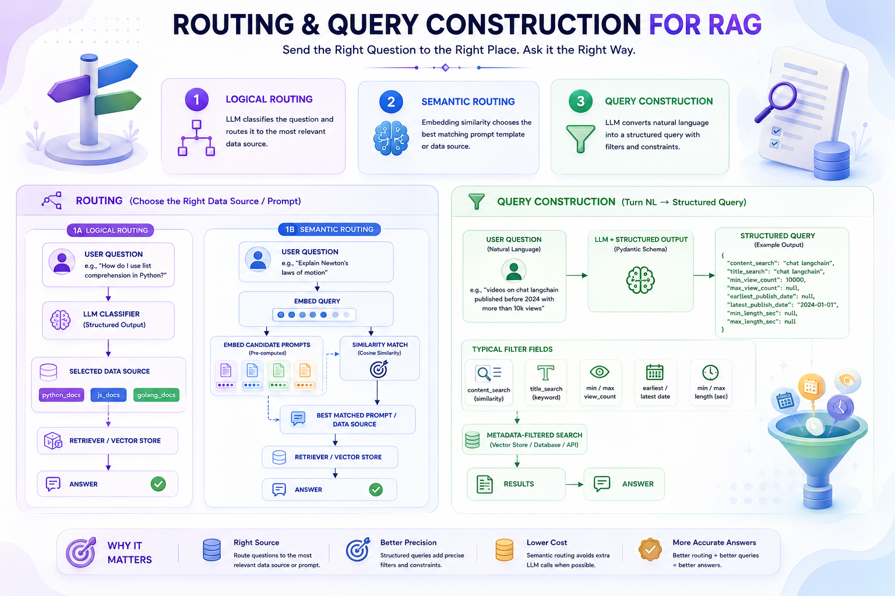
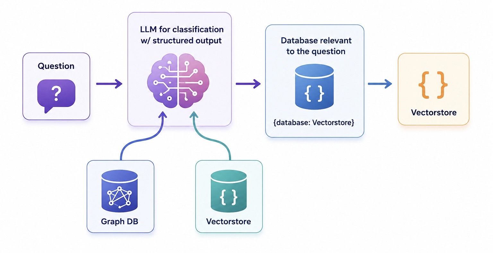

# 🧭 Routing & Query Construction for RAG



Part of the [**Advance-RAG-Technics**](https://github.com/paras160500/Advance-RAG-Technics) series. This module covers **routing** — directing a user's question to the *right* data source — and **query construction** — turning natural language into a structured query that a database/API can actually filter on.

While [query transformation](../2_query_transformation) rewrites *what* a question says, routing and query construction decide *where* to send it and *how* to query it.

---

## 🚀 Techniques Covered

| # | Technique | Idea | Best For |
|---|-----------|------|----------|
| 1 | **Logical Routing** | An LLM classifies the question with a structured output (`Literal` enum) into one of several known data sources | Multi-source RAG where each source is topically distinct (e.g. per-language docs) |
| 2 | **Semantic Routing** | Embed candidate prompt templates once, embed the incoming query, and route to whichever template is most similar (cosine similarity) | Choosing the right *prompt persona* / system instructions without an extra LLM call |
| 3 | **Query Construction** | An LLM converts a free-text question into a structured query object (Pydantic model) with explicit filters (dates, view counts, etc.) | Querying structured/semi-structured stores (SQL, metadata-filtered vector stores, APIs) using natural language |

---

## 🏗️ Architecture

### Logical / Semantic Routing



```
User Question
     │
     ▼
LLM Classifier (structured output)
     │
     ▼
 ┌───────────┬───────────┬───────────┐
 │ python_docs│  js_docs  │golang_docs│   ← Logical routing example
 └───────────┴───────────┴───────────┘
     │
     ▼
Relevant Retriever / Vectorstore
     │
     ▼
Answer
```

### Query Construction

```
User Question (natural language)
     │
     ▼
LLM + Structured Output (Pydantic schema)
     │
     ▼
Structured Query
  content_search, title_search,
  min/max_view_count,
  earliest/latest_publish_date,
  min/max_length_sec
     │
     ▼
Metadata-filtered Search (vector store / DB)
```

---

## 📦 Installation

```bash
pip install langchain langchain-community langchain-core langchain-ollama
pip install pydantic scikit-learn python-dotenv langsmith
pip install yt-dlp youtube-transcript-api
```

### 🧠 Install Ollama (local LLM)

Download from [ollama.com](https://ollama.com), then pull the models used in the notebook:

```bash
ollama pull llama3.2:3b
ollama pull nomic-embed-text
```

### 🔑 Environment Variables

Create a `.env` file in this folder with:

```env
LANGCHAIN_TRACING_V2=true
LANGCHAIN_ENDPOINT=https://api.smith.langchain.com
LANGCHAIN_API_KEY=your_langsmith_api_key
OPENAI_API_KEY=your_openai_api_key
```

> `OPENAI_API_KEY` is only needed if you swap Ollama for OpenAI chat/embedding models. `LANGCHAIN_*` vars enable optional LangSmith tracing.

---

## 🧪 How It Works

The notebook (`main.ipynb`) is split into two parts: **routing** (logical + semantic) and **query construction**.

### 1. Logical Routing

The LLM is forced to pick one of a fixed set of literal options via structured output (`with_structured_output`), so routing is a clean classification step instead of free-text parsing:

```python
class RouteQuery(BaseModel):
    """Route a user query to the most relevant data source."""
    data_source: Literal["python_docs", "js_docs", "golang_docs"] = Field(
        ..., description="Given a user question choose which datasource would be most relevant for answering their question"
    )

llm = ChatOllama(model="llama3.2:3b", temperature=0.2)
structured_llm = llm.with_structured_output(RouteQuery)

router = prompt | structured_llm
```

The router's output then drives a `RunnableLambda` that picks the matching chain:

```python
def choose_route(result):
    if "python_docs" in result.data_source.lower():
        return "chain for python_docs"
    elif "js_docs" in result.data_source.lower():
        return "chain for js_docs"
    else:
        return "golang_docs"

full_chain = router | RunnableLambda(choose_route)
```

### 2. Semantic Routing

Instead of asking the LLM to classify, this approach **embeds candidate prompts once** and routes by computing which prompt embedding is closest to the incoming query's embedding:

```python
prompt_templates = [physics_template, math_template]
prompt_embeddings = embeddings.embed_documents(prompt_templates)

def prompt_router(input):
    query_embedding = embeddings.embed_query(input['query'])
    similarity = cosine_similarity([query_embedding], prompt_embeddings)[0]
    most_similar = prompt_templates[similarity.argmax()]
    return ChatPromptTemplate.from_messages([("human", most_similar)])

chain = (
    {"query": RunnablePassthrough()}
    | RunnableLambda(prompt_router)
    | llm
    | StrOutputParser()
)
```

This is cheaper than an LLM-based router since routing only costs an embedding call, not a generation call.

### 3. Query Construction (Structured Metadata Filtering)

First, a YouTube transcript is loaded and enriched with real metadata (title, view count, publish date, duration) via `yt-dlp`:

```python
docs[0].metadata.update({
    "source": info["id"],
    "title": info["title"],
    "view_count": info.get("view_count", 0),
    "publish_date": ...,
    "length": info.get("duration", 0),
    "author": info.get("uploader", "Unknown"),
})
```

Then a Pydantic schema defines exactly what a valid structured query looks like — a content search, a title search, and optional numeric/date filters:

```python
class TutorialSearch(BaseModel):
    """Search over a database of tutorial videos about a software library."""
    content_search: str = Field(..., description="Similarity search query applied to video transcripts.")
    title_search: str = Field(..., description="Succinct keyword query applied to video titles.")
    min_view_count: Optional[int] = Field(None, description="Minimum view count filter, inclusive.")
    max_view_count: Optional[int] = Field(None, description="Maximum view count filter, exclusive.")
    earliest_publish_date: Optional[datetime.date] = Field(None, description="Earliest publish date filter, inclusive.")
    latest_publish_date: Optional[datetime.date] = Field(None, description="Latest publish date filter, exclusive.")
    min_length_sec: Optional[int] = Field(None, description="Minimum video length in seconds, inclusive.")
    max_length_sec: Optional[int] = Field(None, description="Maximum video length in seconds, exclusive.")
```

The LLM fills this schema from plain English:

```python
query_analyzer = prompt | llm.with_structured_output(TutorialSearch)

query_analyzer.invoke(
    {"question": "videos on chat langchain published in 2023"}
).pretty_print()
```

For example, *"videos that are focused on the topic of chat langchain that are published before 2024"* gets converted into a `content_search` + `latest_publish_date` filter — ready to plug into a metadata-filtered vector search or SQL `WHERE` clause.

---

## ⚡ Tech Stack

- LangChain (Core, Community)
- Ollama — `llama3.2:3b` (LLM) / `nomic-embed-text` (embeddings)
- Pydantic (structured output schemas)
- scikit-learn (`cosine_similarity` for semantic routing)
- yt-dlp / YoutubeLoader (transcript + metadata extraction)
- LangSmith (optional tracing)

---

## 🧠 Key Learnings

- **Logical routing** turns "which data source should answer this?" into a clean classification problem using structured LLM output instead of brittle string parsing.
- **Semantic routing** can replace an LLM call with a much cheaper embedding-similarity lookup when the candidate set (prompts, sources) is fixed and known ahead of time.
- **Query construction** is what lets natural language questions reach structured stores — the LLM's job is to *fill a schema*, not just retrieve text.
- Structured output (`with_structured_output` + Pydantic) is the common thread tying routing and query construction together: it's how you get reliable, machine-usable decisions out of an LLM.

---

## 🚀 Future Improvements

- Add a real multi-source retriever per route (python_docs / js_docs / golang_docs) instead of stub strings
- Wire the `TutorialSearch` structured query into an actual metadata-filtered Chroma/vector search
- Combine logical + semantic routing (cheap semantic pre-filter, LLM fallback for ambiguous cases)
- Add evaluation for routing accuracy (does the router pick the correct source/prompt?)

---

## 👨‍💻 Author

Built for learning: Routing & Query Construction techniques for RAG + LangChain + Local LLMs