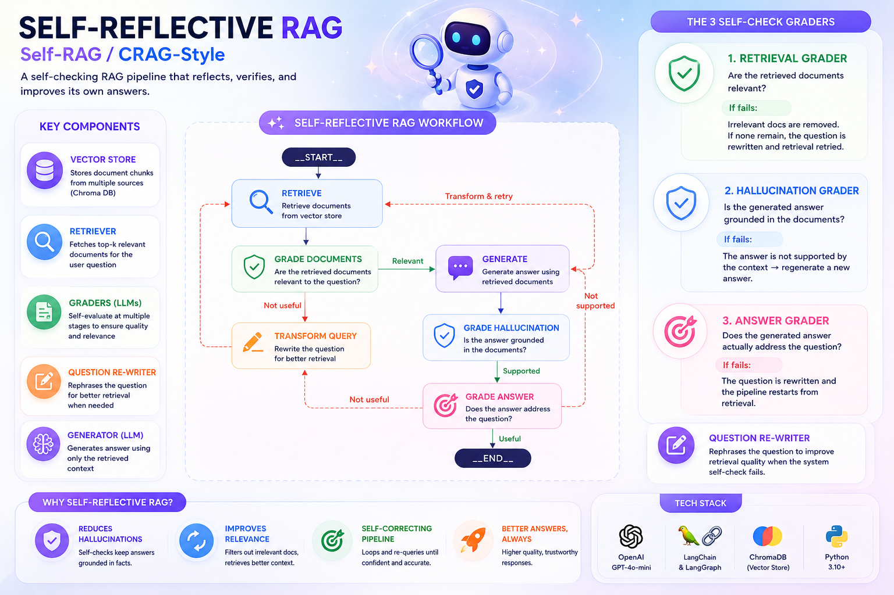
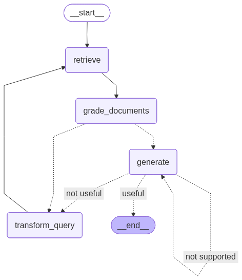

# 🔁 Self-Reflective RAG (Self-RAG / CRAG-style)



Part of the [**Advance-RAG-Technics**](https://github.com/paras160500/Advance-RAG-Technics) series. This module builds a RAG pipeline that **checks its own work** at multiple points using a [LangGraph](https://github.com/langchain-ai/langgraph) state machine — grading retrieved documents for relevance, grading generations for hallucination, grading answers for usefulness, and looping back to retry or re-query when a check fails.

This is the natural next step after [query transformation](../2_query_transformation), [routing](../3_routing_to_datasource.ipynb), and [indexing](../04_Indexing_To_VectorDBs): instead of a single linear retrieve → generate pass, the pipeline becomes a **graph with feedback loops** that can self-correct.

---

## 🚀 Core Idea

A normal RAG chain has no way to know if it retrieved the wrong documents, or if the LLM hallucinated an answer not actually supported by the context. This module adds three **grader LLMs** as checkpoints in the pipeline:

| Grader | Checks | If it fails |
|---|---|---|
| **Retrieval Grader** | Is each retrieved document actually relevant to the question? | Irrelevant docs are filtered out; if *none* are relevant, the query is rewritten and retrieval retried |
| **Hallucination Grader** | Is the generated answer grounded in the retrieved documents? | Answer is regenerated ("not supported" loop back to `generate`) |
| **Answer Grader** | Does the generated answer actually address the user's question? | Query is rewritten and the whole retrieve→generate cycle retried |

A fourth component, the **Question Re-writer**, rephrases the question for better vectorstore retrieval whenever a self-check fails.

---

## 🏗️ Architecture



```
            ┌────────────────────────────────────────────┐
            │                                            │
            ▼                                            │
        __start__                                        │
            │                                            │
            ▼                                            │
        retrieve ◄────────────────────────┐               │
            │                             │               │
            ▼                             │               │
     grade_documents                      │               │
       │         │                        │               │
  not useful    relevant                  │               │
       │         │                        │               │
       ▼         ▼                        │               │
 transform_query  generate ───────────────┼───────────────┘
       ▲           │   ▲                  │   (not supported:
       │           │   │                  │    regenerate)
       │        useful │ not useful       │
       │           │   └──────────────────┘
       │           ▼
       └────────__end__
```

The graph is built and compiled with **LangGraph**'s `StateGraph`, and the diagram above (`graph.png`) is rendered directly from the compiled graph via `app.get_graph().draw_mermaid_png()`.

---

## 📦 Installation

```bash
pip install langchain langchain-community langchain-core langchain-openai
pip install langchain-text-splitters chromadb langgraph
pip install python-dotenv langsmith pydantic
```

### 🔑 Environment Variables

Create a `.env` file in this folder with:

```env
LANGCHAIN_TRACING_V2=true
LANGCHAIN_ENDPOINT=https://api.smith.langchain.com
LANGCHAIN_API_KEY=your_langsmith_api_key
OPENAI_API_KEY=your_openai_api_key
```

> Unlike earlier modules in this series, this one runs entirely on **OpenAI** (`gpt-4o-mini` + `OpenAIEmbeddings`) rather than local Ollama models — `OPENAI_API_KEY` is required.

---

## 🧪 How It Works

The notebook (`main.ipynb`) loads three Lilian Weng blog posts (agents, prompt engineering, adversarial attacks on LLMs) into a Chroma vector store, then wires together graders, a generator, and a LangGraph workflow.

### 1. Retriever

```python
urls = [
    "https://lilianweng.github.io/posts/2023-06-23-agent/",
    "https://lilianweng.github.io/posts/2023-03-15-prompt-engineering/",
    "https://lilianweng.github.io/posts/2023-10-25-adv-attack-llm/",
]
docs_list = [item for sublist in [WebBaseLoader(url).load() for url in urls] for item in sublist]

text_splitter = RecursiveCharacterTextSplitter.from_tiktoken_encoder(chunk_size=250, chunk_overlap=0)
doc_splits = text_splitter.split_documents(docs_list)

vectorstore = Chroma.from_documents(documents=doc_splits, collection_name="rag-chroma", embedding=OpenAIEmbeddings())
retriver = vectorstore.as_retriever()
```

### 2. Retrieval Grader

Uses structured output to force a clean binary decision per document:

```python
class GradeDocuments(BaseModel):
    """Binary score for relevance check on retrived documents."""
    binary_score: str = Field(description="Whether the documents are relevant to the question.")

structured_llm_grader = ChatOpenAI(model="gpt-4o-mini", temperature=0).with_structured_output(GradeDocuments)
retrieval_grader = grade_prompt | structured_llm_grader
```

### 3. Generation

A strict, context-only prompt that explicitly refuses to answer outside the provided documents:

```python
prompt = ChatPromptTemplate.from_template("""
You are an AI assistant.

Use ONLY the following context to answer the question.
If the answer cannot be found in the context, say "I don't know."

Context:
{documents}

Question:
{question}

Answer:
""")

rag_chain = prompt | llm | StrOutputParser()
```

### 4. Hallucination Grader & Answer Grader

Both follow the same structured-output pattern as the retrieval grader — one checks the generation against the *documents*, the other checks it against the *question*:

```python
class GradeHallucination(BaseModel):
    """Binary score for hallucination present in the generated answer."""
    binary_score: str = Field(description="Answer is grounded in the facts, 'yes' or 'no'")

class GradeAnswer(BaseModel):
    """Binary score to assess answer addresses questions"""
    binary_score: str = Field(description="Answer addresses the question, 'yes' or 'no'")
```

### 5. Question Re-writer

```python
system = """You are a question re-writer that converts an input question to a better version that is optimized
     for vectorstore retrieval. Look at the input and try to reason about the underlying semantic intent / meaning."""

question_retriver = re_write_prompt | llm | StrOutputParser()
```

### 6. Graph State & Nodes

```python
class GraphState(TypedDict):
    question: str
    generation: str
    documents: List[str]
```

Four nodes operate on this shared state: `retrive` (fetch documents), `grade_documents` (filter to relevant ones), `generate` (produce an answer), and `transform_query` (rewrite the question on failure).

Two conditional-edge functions decide where to go next:

```python
def decide_to_generate(state):
    if not state["documents"]:
        return "transform_query"   # no relevant docs → rewrite & retry
    return "generate"

def grade_generation_v_documents_and_question(state):
    grade = hallucination_grader.invoke({...}).binary_score
    if grade == "yes":
        grade = answer_grader.invoke({...}).binary_score
        return "useful" if grade == "yes" else "not useful"
    return "not supported"   # hallucinated → regenerate
```

### 7. Wiring the Graph

```python
workflow = StateGraph(GraphState)

workflow.add_node("retrieve", retrive)
workflow.add_node("grade_documents", grade_documents)
workflow.add_node("generate", generate)
workflow.add_node("transform_query", transform_query)

workflow.set_entry_point("retrieve")
workflow.add_edge("retrieve", "grade_documents")
workflow.add_conditional_edges(
    "grade_documents", decide_to_generate,
    {"transform_query": "transform_query", "generate": "generate"}
)
workflow.add_edge("transform_query", "retrieve")
workflow.add_conditional_edges(
    "generate", grade_generation_v_documents_and_question,
    {"not supported": "generate", "useful": END, "not useful": "transform_query"}
)

app = workflow.compile()
```

### 8. Running It

```python
inputs = {"question": "Explain how the different types of agent memory work?"}
for output in app.stream(inputs):
    for key, value in output.items():
        print(f"Node '{key}':")
print(value["generation"])
```

Streaming the graph prints each node as it fires (`retrieve` → `grade_documents` → `generate` → ...), making the self-correction loops visible in real time.

---

## ⚡ Tech Stack

- LangChain (Core, Community, OpenAI, Text Splitters)
- **LangGraph** (`StateGraph`, conditional edges, graph compilation/visualization)
- OpenAI — `gpt-4o-mini` (generation + all three graders) / `OpenAIEmbeddings` (vector store)
- ChromaDB (vector store)
- Pydantic (structured grader outputs)
- LangSmith (optional tracing — especially useful here for inspecting multi-step graph runs)

---

## 🧠 Key Learnings

- Turning RAG into a **graph instead of a chain** is what makes self-correction possible — a linear chain has no place to "go back" when a check fails.
- Structured output (`with_structured_output` + Pydantic `binary_score` fields) is the cleanest way to get reliable yes/no decisions out of an LLM grader — no brittle string parsing.
- Self-reflection is layered: relevance is checked *before* generation, while groundedness and usefulness are checked *after* — different failure modes need checks at different pipeline stages.
- Query rewriting is the shared recovery mechanism for two different failures (no relevant docs, and generation that doesn't address the question) — it's the pipeline's main lever for "try again, but smarter."
- This pattern combines ideas from both **Self-RAG** (reflection tokens / self-critique) and **CRAG** (Corrective RAG's relevance grading and query rewriting), without needing a custom-trained critique model — it's all done via prompting + structured output.

---

## 🚀 Future Improvements

- Add a max-retry / loop counter so `transform_query` and `generate` can't loop indefinitely on a genuinely unanswerable question
- Replace binary relevance/hallucination scores with **graded confidence** (e.g. 0–1 scores) for finer-grained routing decisions
- Add a **web search fallback** node (CRAG-style) for when no retrieved document is relevant, instead of only rewriting the query
- Persist graph state with LangGraph's checkpointer to support multi-turn conversations and resumable runs

---

## 👨‍💻 Author

Built for learning: Self-Reflective RAG (Self-RAG / CRAG-style) with LangGraph + LangChain + OpenAI