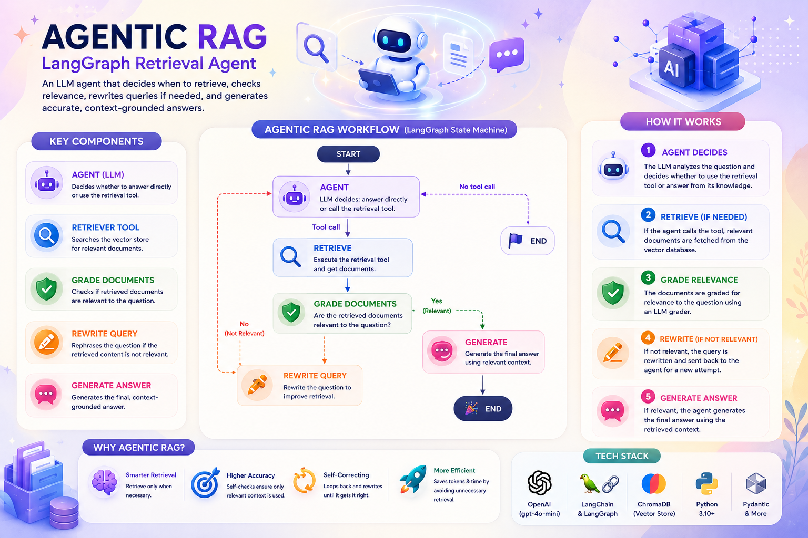

# 🤖 Agentic RAG (LangGraph Retrieval Agent)



Part of the [**Advance-RAG-Technics**](https://github.com/paras160500/Advance-RAG-Technics) series. This module turns retrieval into a **tool the LLM decides whether to use**, rather than a step that always runs. The agent itself chooses if/when to retrieve, checks whether what it retrieved was relevant, and rewrites its own query if not — all orchestrated as a [LangGraph](https://github.com/langchain-ai/langgraph) state machine.

This builds directly on [**6_self_reflection_rag**](../6_self_reflection_rag): the relevance-grading and query-rewriting ideas carry over, but here retrieval is wrapped as a **bound tool** and the LLM agent itself decides to call it via tool-calling, instead of retrieval being a fixed first node in the graph.

---

## 🚀 Core Idea

A standard RAG pipeline always retrieves, even for questions that don't need it. An **agentic** RAG pipeline gives the LLM a retrieval tool and lets it reason about whether to call it:

| Component | Role |
|---|---|
| **Agent node** | LLM (with a bound retriever tool) decides: answer directly, or call the tool to retrieve first |
| **Retrieve node** | Executes the tool call(s) the agent requested and returns results as `ToolMessage`s |
| **Grade Documents** | Checks whether the retrieved content is actually relevant to the question |
| **Rewrite node** | If retrieved docs aren't relevant, reformulates the question and sends it back to the agent |
| **Generate node** | Produces the final, context-grounded answer once relevant docs are in hand |

---

## 🏗️ Architecture

```
            START
              │
              ▼
         ┌─────────┐
         │  agent  │◄────────────────┐
         └─────────┘                 │
           │      │                  │
   tool call?     no tool call       │
           │      │                  │
           ▼      ▼                  │
      ┌─────────┐  END               │
      │ retrieve │                   │
      └─────────┘                    │
           │                         │
     grade_documents                 │
       │         │                   │
      "no"      "yes"                │
       │         │                   │
       ▼         ▼                   │
   ┌────────┐ ┌──────────┐           │
   │ rewrite│ │ generate │           │
   └────────┘ └──────────┘           │
       │           │                 │
       └───────────┼─────► back to agent
                    ▼
                   END
```

The agent decides whether to retrieve at all (`should_retrieve`); if it retrieves, a second LLM call grades relevance (`grade_documents`) and routes to either `generate` (relevant) or `rewrite` (not relevant, loop back through `agent`).

---

## 📦 Installation

```bash
pip install langchain langchain-community langchain-core langchain-openai
pip install langchain-text-splitters chromadb langgraph
pip install python-dotenv langsmith pydantic
```

A consolidated [`requirements.txt`](../requirements.txt) covering the whole repo is also available at the project root.

### 🔑 Environment Variables

Create a `.env` file in this folder with:

```env
LANGCHAIN_TRACING_V2=true
LANGCHAIN_ENDPOINT=https://api.smith.langchain.com
LANGCHAIN_API_KEY=your_langsmith_api_key
OPENAI_API_KEY=your_openai_api_key
```

> This module runs entirely on **OpenAI** (`gpt-4o-mini` + `OpenAIEmbeddings`) — `OPENAI_API_KEY` is required.

---

## 🧪 How It Works

The notebook (`main.ipynb`) loads the same three Lilian Weng blog posts used elsewhere in this series, wraps the retriever as a callable **tool**, and builds a LangGraph agent around it.

### 1. Retriever + Tool

```python
text_splitter = RecursiveCharacterTextSplitter.from_tiktoken_encoder(chunk_size=100, chunk_overlap=50)
doc_splits = text_splitter.split_documents(docs_list)

vectorstore = Chroma.from_documents(documents=doc_splits, collection_name="rag-chroma", embedding=OpenAIEmbeddings())
retriever = vectorstore.as_retriever()
```

The retriever is exposed to the LLM as a named, described tool — this description is what the agent reads to decide *when* to call it:

```python
from langchain_core.tools import create_retriever_tool

tool = create_retriever_tool(
    retriever,
    "retrieve_blog_posts",
    "Search and return information about Lilian Weng blog posts on LLM agents, prompt engineering, and adversarial attacks on LLMs.",
)
tools = [tool]
```

### 2. Agent State

```python
class AgentState(TypedDict):
    messages: Annotated[Sequence[BaseMessage], lambda x, y: x + list(y)]
```

State is a running list of messages (human, AI, and tool messages) — the same pattern used by LangGraph's prebuilt ReAct agents.

### 3. Agent Node — Decide to Retrieve

```python
def agent(state: AgentState):
    """Invokes the agent model to decide to retrieve or respond using bind_tools."""
    messages = state["messages"]
    model = ChatOpenAI(temperature=0, model="gpt-4o-mini").bind_tools(tools)
    response = model.invoke(messages)
    return {"messages": [response]}
```

`bind_tools` is what lets the LLM emit a tool call instead of (or in addition to) a text answer.

### 4. Routing — Retrieve or End

```python
def should_retrieve(state: AgentState):
    """Decides whether the agent should retrieve more information or end the process."""
    last_message = state["messages"][-1]
    if isinstance(last_message, AIMessage) and last_message.tool_calls:
        return "continue"
    else:
        return "end"
```

### 5. Retrieve Node — Execute the Tool Call

```python
def retrieve(state: AgentState):
    """Executes the modern Tool Call handling."""
    last_message = state["messages"][-1]
    tool_messages = []
    for tool_call in last_message.tool_calls:
        if tool_call["name"] == "retriever_tool":
            query = tool_call["args"].get("query", "")
            response_content = retriever_tool(query)
            tool_messages.append(
                ToolMessage(content=str(response_content), tool_call_id=tool_call["id"], name=tool_call["name"])
            )
    return {"messages": tool_messages}
```

### 6. Grade Documents — Relevance Check

Same structured-output binary-grading pattern as the self-reflection module, but here it operates on the latest `ToolMessage` in the conversation:

```python
def grade_documents(state: AgentState):
    """Determines whether the retrieved documents are relevant to the question."""
    class Grade(BaseModel):
        """Binary score for relevance check."""
        binary_score: str = Field(description="Relevance score 'yes' or 'no'")

    structured_llm = ChatOpenAI(temperature=0, model="gpt-4o-mini").with_structured_output(Grade)
    chain = prompt | structured_llm

    question = state["messages"][0].content
    tool_messages = [m for m in state["messages"] if isinstance(m, ToolMessage)]
    docs = tool_messages[-1].content if tool_messages else ""

    score = chain.invoke({"question": question, "context": docs})
    return "yes" if score.binary_score.lower().strip() == "yes" else "no"
```

### 7. Rewrite Node — Improve the Query

```python
def rewrite(state: AgentState):
    """Transform the query to produce a better question."""
    question = state["messages"][0].content
    msg = [HumanMessage(content=f"...Here is the initial question:\n-------\n{question}\n-------\nFormulate an improved question:")]
    response = ChatOpenAI(temperature=0, model="gpt-4o-mini").invoke(msg)
    return {"messages": [response]}
```

The rewritten question is appended to the message history and flows back into `agent`, giving the LLM another chance to retrieve with better phrasing.

### 8. Generate Node — Final Answer

```python
prompt = PromptTemplate.from_template("""
    You are a helpful assistant. Answer the user's question using only the provided context.
    Context: {context}
    Question: {question}
    Instructions:
    - If the answer is not in the context, say "I don't know based on the provided information."
    - Keep the answer concise and accurate.
    - Do not make up information.
    Answer:
""")

rag_chain = prompt | ChatOpenAI(model_name="gpt-4o-mini", temperature=0) | StrOutputParser()
```

### 9. Wiring the Graph

```python
workflow = StateGraph(AgentState)

workflow.add_node("agent", agent)
workflow.add_node("retrieve", retrieve)
workflow.add_node("rewrite", rewrite)
workflow.add_node("generate", generate)

workflow.add_edge(START, "agent")
workflow.add_conditional_edges("agent", should_retrieve, {"continue": "retrieve", "end": END})
workflow.add_conditional_edges("retrieve", grade_documents, {"yes": "generate", "no": "rewrite"})
workflow.add_edge("generate", END)
workflow.add_edge("rewrite", "agent")

app = workflow.compile()
```

### 10. Running It

```python
inputs = {"messages": [HumanMessage(content="What does Lilian Weng say about the types of agent memory?")]}

for output in app.stream(inputs):
    for key, value in output.items():
        pprint.pprint(f"Output from node '{key}':")
        pprint.pprint(value, indent=2, width=80, depth=None)
```

Streaming shows the live decision trail: `agent` decides to retrieve → `retrieve` executes the tool → `grade_documents` checks relevance → `generate` produces the grounded final answer.

---

## ⚡ Tech Stack

- LangChain (Core, Community, OpenAI, Text Splitters)
- **LangGraph** (`StateGraph`, `ToolNode`, conditional edges, `bind_tools` agent pattern)
- OpenAI — `gpt-4o-mini` (agent, grader, rewriter, generator) / `OpenAIEmbeddings` (vector store)
- ChromaDB (vector store)
- Pydantic (structured grader output)
- LangSmith (optional tracing)

---

## 🧠 Key Learnings

- **Retrieval-as-a-tool** flips the control flow: instead of the pipeline always retrieving, the LLM itself reasons about whether retrieval is necessary for a given question.
- `bind_tools` + checking `AIMessage.tool_calls` is the modern, structured way to detect "the model wants to call a tool" — far more reliable than parsing free text for function-call intent.
- The same relevance-grading and query-rewriting ideas from self-reflective RAG reappear here, but now nested *inside* an agent loop rather than a fixed linear pipeline — showing how these techniques compose.
- Because state is a running message list, the full conversation (including intermediate tool calls and rewrites) is preserved and inspectable — useful for debugging *why* the agent retrieved, rewrote, or answered directly.
- The notebook includes a mocked `retriever_tool` function alongside the real Chroma-backed retriever — useful for testing the graph's control flow without burning API calls on embeddings/retrieval every run.

---

## 🚀 Future Improvements

- Add a retry/loop limit so `rewrite → agent → retrieve` can't cycle indefinitely on a genuinely unanswerable question
- Give the agent multiple tools (e.g. one retriever per data source) so routing decisions become part of the agent's tool-selection, not just retrieve-or-not
- Add a hallucination/answer-usefulness grader after `generate` (as in the self-reflection module) for a fully closed-loop agentic RAG system
- Replace the mocked `retriever_tool` with the real Chroma retriever end-to-end and benchmark agent decisions against a fixed always-retrieve baseline

---

## 👨‍💻 Author

Built for learning: Agentic RAG with LangGraph + LangChain + OpenAI