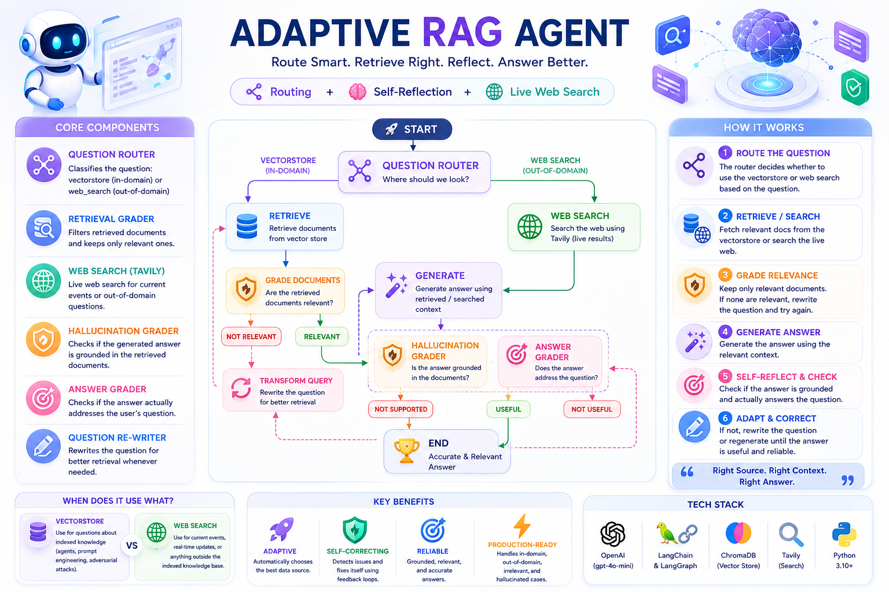
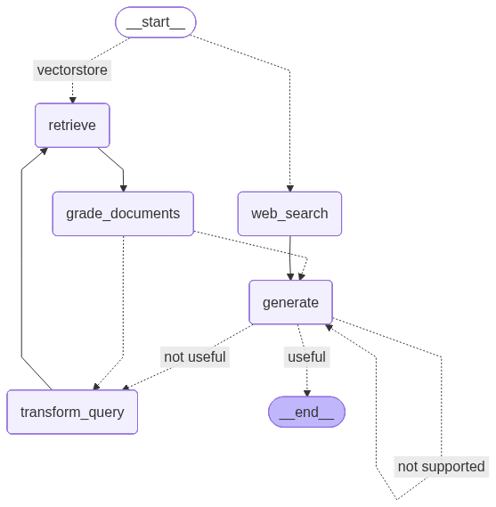

# 🧠 Adaptive RAG Agent



Part of the [**Advance-RAG-Technics**](https://github.com/paras160500/Advance-RAG-Technics) series. This module is the **synthesis** of the series so far: it combines **query routing** (decide *where* to look — vectorstore vs. live web search) with the **self-reflective grading and correction loop** from [`6_self_reflection_rag`](../6_self_reflection_rag) into a single [LangGraph](https://github.com/langchain-ai/langgraph) workflow.

"Adaptive" here means the pipeline doesn't just self-correct after retrieval — it first **adapts its data source** to the question, falling back to web search for anything outside its indexed knowledge base.

---

## 🚀 Core Idea

A fixed RAG pipeline assumes every question can be answered from one vector store. Real questions often can't — some need current/live information the index was never built for. This pipeline adds a **routing decision at the entry point**, on top of the existing self-correction graders:

| Component | Role |
|---|---|
| **Question Router** | Classifies the incoming question: `vectorstore` (in-domain) or `web_search` (everything else, e.g. current events) |
| **Retrieval Grader** | Filters retrieved vectorstore documents down to only the relevant ones |
| **Web Search Tool** (Tavily) | Live web search used when the question is routed away from the vectorstore, or as the fallback for irrelevant retrieval |
| **Hallucination Grader** | Checks the generated answer is actually grounded in the retrieved/searched documents |
| **Answer Grader** | Checks the generated answer actually addresses the question |
| **Question Re-writer** | Rewrites the question for better retrieval whenever a downstream check fails |

---

## 🏗️ Architecture



```
                         __start__
                        /          \
                 vectorstore      web_search
                    │                  │
                    ▼                  │
               retrieve                │
                    │                  │
                    ▼                  │
            grade_documents            │
              │         │              │
         not relevant  relevant        │
              │         │              │
              ▼         └──────────────┤
       transform_query                 ▼
              ▲                    generate
              │                  /    │    \
              │           not supported  useful  not useful
              │                 │         │         │
              └─────────────────┘         ▼         │
                                        __end__      │
              ▲                                      │
              └──────────────────────────────────────┘
```

The router decides the *entry point* of the graph (`vectorstore` → `retrieve`, `web_search` → `web_search`); everything downstream is the same self-correcting generate/grade/retry loop as the self-reflection module.

---

## 📦 Installation

```bash
pip install langchain langchain-community langchain-core langchain-openai
pip install langchain-text-splitters chromadb langgraph
pip install python-dotenv langsmith pydantic
pip install tavily-python
```

A consolidated [`requirements.txt`](../requirements.txt) covering the whole repo is also available at the project root.

### 🔑 Environment Variables

Create a `.env` file in this folder with:

```env
OPENAI_API_KEY=your_openai_api_key
COHERE_API_KEY=your_cohere_api_key
TAVILY_API_KEY=your_tavily_api_key
LANGCHAIN_TRACING_V2=true
LANGCHAIN_ENDPOINT=https://api.smith.langchain.com
LANGCHAIN_API_KEY=your_langsmith_api_key
```

> `OPENAI_API_KEY` powers the router, graders, and generator (all `gpt-4o-mini`). `TAVILY_API_KEY` is **required** for the web search fallback. `COHERE_API_KEY` is loaded but not used in the current notebook — likely reserved for an optional re-ranking step.

---

## 🧪 How It Works

The notebook (`main.ipynb`) indexes the same three Lilian Weng blog posts used elsewhere in the series, then builds six LLM components and wires them into a routed, self-correcting graph.

### 1. Index

```python
text_splitter = RecursiveCharacterTextSplitter.from_tiktoken_encoder(chunk_size=500, chunk_overlap=0)
doc_splits = text_splitter.split_documents(docs_list)
vectorstore = Chroma.from_documents(documents=doc_splits, collection_name="rag-chroma", embedding=embd)
retriever = vectorstore.as_retriever()
```

### 2. Question Router

```python
class RouteQuery(BaseModel):
    """Route a user query into most suitable data source"""
    datasource: Literal["vectorstore", "web_search"] = Field(
        ..., description="Given a user question choose to route it to web search or a vectorstore."
    )

system = """You are an expert at routing a user question to a vectorstore or web search.
The vectorstore contains documents related to agents, prompt engineering, and adversarial attacks.
Use the vectorstore for questions on these topics. Otherwise, use web-search."""

question_router = route_prompt | llm.with_structured_output(RouteQuery)
```

A question like *"Who will the Bears draft first in the NFL draft?"* routes to `web_search`; *"What are the types of agent memory?"* routes to `vectorstore`.

### 3. Retrieval Grader, Hallucination Grader, Answer Grader

All three follow the same structured-output binary-score pattern carried over from the self-reflection module — grading document relevance, groundedness of the generation, and whether the generation actually answers the question.

### 4. Web Search Tool

```python
from langchain_community.tools.tavily_search import TavilySearchResults
web_search_tool = TavilySearchResults(k=3)
```

### 5. Graph Nodes

```python
def retrieve(state):
    documents = retriever.invoke(state["question"])
    return {"documents": documents, "question": state["question"]}

def web_search(state):
    docs = web_search_tool.invoke({"query": state["question"]})
    web_results = Document(page_content="\n".join(d["content"] for d in docs))
    return {"documents": web_results, "question": state["question"]}

def generate(state):
    generation = rag_chain.invoke({"context": state["documents"], "question": state["question"]})
    return {"documents": state["documents"], "question": state["question"], "generation": generation}

def grade_documents(state):
    filtered_docs = [
        d for d in state["documents"]
        if retriver_grader.invoke({"question": state["question"], "document": d.page_content}).binary_score == "yes"
    ]
    return {"documents": filtered_docs, "question": state["question"]}

def transform_query(state):
    better_question = question_rewriter.invoke({"question": state["question"]})
    return {"documents": state["documents"], "question": better_question}
```

### 6. Conditional Edge Functions

```python
def route_question(state):
    source = question_router.invoke({"question": state["question"]})
    return "web_search" if source.datasource == "web_search" else "vectorstore"

def decide_to_generate(state):
    return "transform_query" if not state["documents"] else "generate"

def grade_generation_v_documents_and_question(state):
    grade = hallucination_grader.invoke({"documents": state["documents"], "generation": state["generation"]}).binary_score
    if grade == "yes":
        grade = answer_grader.invoke({"question": state["question"], "generation": state["generation"]}).binary_score
        return "useful" if grade == "yes" else "not useful"
    return "not supported"
```

### 7. Wiring the Graph

The router becomes a **conditional entry point** rather than a regular node — this is what lets the graph start at different places depending on the question:

```python
workflow = StateGraph(GraphState)

workflow.add_node("web_search", web_search)
workflow.add_node("retrieve", retrieve)
workflow.add_node("grade_documents", grade_documents)
workflow.add_node("generate", generate)
workflow.add_node("transform_query", transform_query)

workflow.set_conditional_entry_point(
    route_question,
    {"web_search": "web_search", "vectorstore": "retrieve"},
)
workflow.add_edge("web_search", "generate")
workflow.add_edge("retrieve", "grade_documents")
workflow.add_conditional_edges(
    "grade_documents", decide_to_generate,
    {"transform_query": "transform_query", "generate": "generate"},
)
workflow.add_edge("transform_query", "retrieve")
workflow.add_conditional_edges(
    "generate", grade_generation_v_documents_and_question,
    {"not supported": "generate", "useful": END, "not useful": "transform_query"},
)

app = workflow.compile()
```

### 8. Running It

```python
inputs = {"question": "What player at the Bears expected to draft first in the 2024 NFL draft?"}
for output in app.stream(inputs):
    for key, value in output.items():
        pprint(f"Node '{key}':")
    pprint("\n---\n")
pprint(value["generation"])
```

This question routes straight to `web_search` (out-of-domain, time-sensitive), while *"What are the types of agent memory?"* routes to `retrieve` against the indexed blog posts — same graph, two different entry paths.

---

## ⚡ Tech Stack

- LangChain (Core, Community, OpenAI, Text Splitters)
- **LangGraph** (`StateGraph`, conditional entry point, conditional edges, graph visualization)
- OpenAI — `gpt-4o-mini` (router, graders, rewriter, generator) / `OpenAIEmbeddings`
- **Tavily Search** (live web search fallback)
- ChromaDB (vector store)
- Pydantic (structured router/grader outputs)
- LangSmith (optional tracing)

---

## 🧠 Key Learnings

- **Routing and self-correction are complementary, not redundant.** Routing decides *where* to start (which data source); grading/rewriting decides *whether what came back is good enough*, regardless of which source it came from.
- A **conditional entry point** (`set_conditional_entry_point`) is the LangGraph mechanism that lets a single compiled graph behave differently depending on the question — no need for two separate graphs for "vectorstore RAG" and "web search RAG".
- Web search results and vectorstore results are normalized into the *same* `documents` state field, so every downstream node (grading, generation) works identically regardless of where the content came from.
- This is the most "production-shaped" pipeline in the series so far: it handles in-domain questions, out-of-domain questions, irrelevant retrieval, hallucinated answers, and off-target answers — each with its own explicit recovery path.

---

## 🚀 Future Improvements

- Use the loaded but unused `COHERE_API_KEY` to add a re-ranking step after retrieval/web search, before grading
- Add a retry/loop limit to prevent indefinite `generate ↔ transform_query` cycling on a genuinely unanswerable question
- Let `grade_documents` also trigger a web-search fallback (not just `transform_query`) when *all* vectorstore documents are irrelevant — closer to true CRAG behavior
- Add quantitative evaluation (e.g. Ragas) comparing adaptive routing vs. always-vectorstore and always-web-search baselines

---

## 👨‍💻 Author

Built for learning: Adaptive RAG (routing + self-reflection) with LangGraph + LangChain + OpenAI + Tavily   