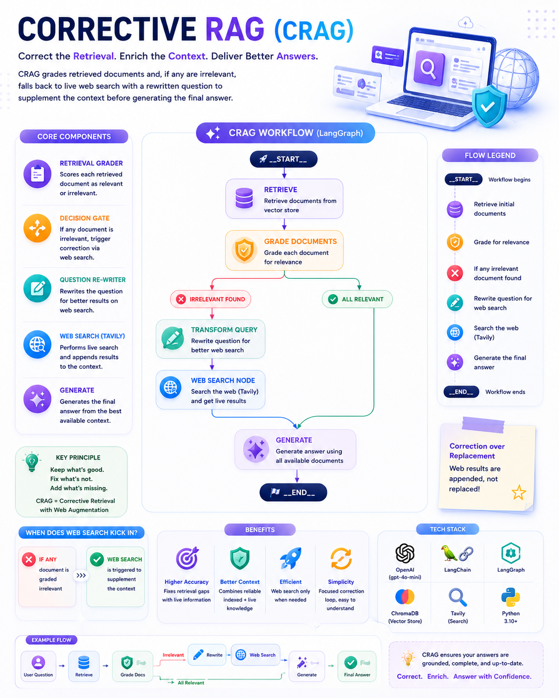
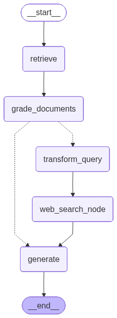

# 🛠️ Corrective RAG (CRAG)



Part of the [**Advance-RAG-Technics**](https://github.com/paras160500/Advance-RAG-Technics) series. This module implements the classic **Corrective RAG (CRAG)** pattern: grade every retrieved document, and the moment *any* document is found irrelevant, fall back to a **live web search** to supplement (not replace) what was retrieved — then generate from whichever documents survive.

This is a leaner sibling of [`8_Adaptive_Rag_Agent`](../8_Adaptive_Rag_Agent): both use a retrieval grader and a web-search fallback, but this module skips the upfront routing decision and the post-generation hallucination/answer graders, focusing purely on the "fix bad retrieval with web search" correction loop.

---

## 🚀 Core Idea

| Component | Role |
|---|---|
| **Retrieval Grader** | Scores each retrieved document as relevant/irrelevant to the question |
| **Decision Gate** | If *any* document was graded irrelevant, trigger correction; otherwise generate directly |
| **Question Re-writer** | Rewrites the question to be better suited for **web search** (not vectorstore retrieval, unlike earlier modules) |
| **Web Search Tool** (Tavily) | Fetches live results with the rewritten question and **appends** them to the surviving filtered documents |
| **Generate** | Produces the final answer from whatever documents made it through — vectorstore-only, or vectorstore + web |

The key correction signal here is a single `web_search: "Yes"/"No"` flag set during grading — simpler than the multi-stage routing/hallucination/answer-grading combo in the Adaptive RAG module.

---

## 🏗️ Architecture



```
        __start__
            │
            ▼
        retrieve
            │
            ▼
    grade_documents
       │         │
  irrelevant   all relevant
   found         │
       │         │
       ▼         │
 transform_query  │
       │          │
       ▼          │
 web_search_node  │
       │          │
       └────┬─────┘
            ▼
        generate
            │
            ▼
         __end__
```

Note the asymmetry vs. earlier modules: web search results are **appended** to the existing (filtered) documents rather than replacing them — `generate` always sees the relevant vectorstore docs *plus* web results when correction fires.

---

## 📦 Installation

```bash
pip install langchain langchain-community langchain-core langchain-openai
pip install langchain-text-splitters chromadb langgraph
pip install python-dotenv langsmith pydantic
pip install tavily-python
```

A consolidated [`requirements.txt`](../requirements.txt) covering the whole repo is also available at the project root.

### 🔑 Environment Variables

Create a `.env` file in this folder with:

```env
OPENAI_API_KEY=your_openai_api_key
COHERE_API_KEY=your_cohere_api_key
TAVILY_API_KEY=your_tavily_api_key
LANGCHAIN_TRACING_V2=true
LANGCHAIN_ENDPOINT=https://api.smith.langchain.com
LANGCHAIN_API_KEY=your_langsmith_api_key
```

> `OPENAI_API_KEY` powers the grader, rewriter, and generator (`gpt-4o-mini`). `TAVILY_API_KEY` is **required** for the web search correction step. `COHERE_API_KEY` is loaded but unused in the current notebook — likely reserved for an optional re-ranking step.

---

## 🧪 How It Works

The notebook (`main.ipynb`) indexes the same three Lilian Weng blog posts used elsewhere in the series, then builds the grader, rewriter, web search tool, and a self-correcting LangGraph workflow.

### 1. Index

```python
text_splitter = RecursiveCharacterTextSplitter.from_tiktoken_encoder(chunk_size=250, chunk_overlap=0)
doc_splits = text_splitter.split_documents(docs_list)
vectorstore = Chroma.from_documents(documents=doc_splits, collection_name="rag-chroma", embedding=OpenAIEmbeddings())
retriever = vectorstore.as_retriever()
```

### 2. Retrieval Grader

```python
class GradeDocuments(BaseModel):
    """Binary Score for relevance check on retrived documents"""
    binary_score: str = Field(description="Documents are relevant to the question, 'yes' or 'no'")

structured_llm = ChatOpenAI(model="gpt-4o-mini", temperature=0).with_structured_output(GradeDocuments)
retrieval_grader = grade_prompt | structured_llm
```

### 3. Generate

```python
prompt = PromptTemplate.from_template("""
    You are a helpful assistant. Answer the user's question using only the provided context.
    Context: {context}
    Question: {question}
    Instructions:
    - If the answer is not in the context, say "I don't know based on the provided information."
    - Keep the answer concise and accurate.
    - Do not make up information.
    Answer:
""")

rag_chain = prompt | llm | StrOutputParser()
```

### 4. Question Re-writer (Web-Search Optimized)

Notably, the rewrite prompt here targets **web search**, not vectorstore retrieval — a small but deliberate distinction from the rewriters in earlier modules:

```python
system = """You a question re-writer that converts an input question to a better version that is optimized
     for web search. Look at the input and try to reason about the underlying sematic intent / meaning."""

question_rewriter = re_write_prompt | llm | StrOutputParser()
```

### 5. Web Search Tool

```python
from langchain_community.tools.tavily_search import TavilySearchResults
web_search_tool = TavilySearchResults(k=3)
```

### 6. Graph State

```python
class GraphState(TypedDict):
    question: str
    generation: str
    web_search: str       # "Yes" / "No" — correction flag
    documents: List[str]
```

### 7. Nodes

```python
def retrieve(state):
    documents = retriever.invoke(state["question"])
    return {"documents": documents, "question": state["question"]}

def generate(state):
    generation = rag_chain.invoke({"context": state["documents"], "question": state["question"]})
    return {"documents": state["documents"], "question": state["question"], "generation": generation}

def grade_documents(state):
    filtered_docs = []
    web_search = "No"
    for d in state["documents"]:
        score = retrieval_grader.invoke({"question": state["question"], "document": d.page_content})
        if score.binary_score == "yes":
            filtered_docs.append(d)
        else:
            web_search = "Yes"   # even ONE irrelevant doc flips the flag
    return {"documents": filtered_docs, "question": state["question"], "web_search": web_search}

def transform_query(state):
    better_question = question_rewriter.invoke({"question": state["question"]})
    return {"documents": state["documents"], "question": better_question}

def web_search(state):
    docs = web_search_tool.invoke({"query": state["question"]})
    web_results = Document(page_content="\n".join(d["content"] for d in docs))
    documents = state["documents"]
    documents.append(web_results)        # APPEND, don't replace
    return {"documents": documents, "question": state["question"]}
```

### 8. Conditional Routing

```python
def decide_to_generate(state):
    if state["web_search"] == "Yes":
        return "transform_query"
    else:
        return "generate"
```

### 9. Wiring the Graph

```python
workflow = StateGraph(GraphState)

workflow.add_node("retrieve", retrieve)
workflow.add_node("grade_documents", grade_documents)
workflow.add_node("generate", generate)
workflow.add_node("transform_query", transform_query)
workflow.add_node("web_search_node", web_search)

workflow.set_entry_point("retrieve")
workflow.add_edge("retrieve", "grade_documents")
workflow.add_conditional_edges(
    "grade_documents", decide_to_generate,
    {"transform_query": "transform_query", "generate": "generate"},
)
workflow.add_edge("transform_query", "web_search_node")
workflow.add_edge("web_search_node", "generate")
workflow.add_edge("generate", END)

app = workflow.compile()
```

### 10. Running It

```python
inputs = {"question": "What are the types of agent memory?"}
for output in app.stream(inputs):
    for key, value in output.items():
        pprint(f"Node '{key}':")
    pprint("\n---\n")
pprint(value["generation"])
```

If even one chunk grades irrelevant, the trace shows `retrieve → grade_documents → transform_query → web_search_node → generate`; if everything retrieved is relevant, it short-circuits straight to `retrieve → grade_documents → generate`.

---

## ⚡ Tech Stack

- LangChain (Core, Community, OpenAI, Text Splitters)
- **LangGraph** (`StateGraph`, conditional edges, graph visualization)
- OpenAI — `gpt-4o-mini` (grader, rewriter, generator) / `OpenAIEmbeddings`
- **Tavily Search** (web search correction step)
- ChromaDB (vector store)
- Pydantic (structured grader output)
- LangSmith (optional tracing)

---

## 🧠 Key Learnings

- **CRAG's correction is additive, not replacement-based** — web results supplement the relevant documents that survived grading, rather than discarding the vectorstore retrieval entirely. This preserves whatever was actually useful from the index.
- A single `web_search` flag set during grading is enough to drive the entire correction branch — you don't need per-document routing logic once the binary "was anything irrelevant?" signal exists.
- The question rewriter is **purpose-specific**: optimized for *web search* phrasing here, vs. *vectorstore retrieval* phrasing in modules like `6_self_reflection_rag` and `8_Adaptive_Rag_Agent` — a reminder that "improve the query" means different things depending on the downstream consumer.
- Compared to Adaptive RAG, this module shows that **not every self-correcting pipeline needs hallucination/answer-usefulness grading** — sometimes just fixing the retrieval input is enough, and the added grader calls are an explicit cost/quality trade-off you can choose to skip.

---

## 🚀 Future Improvements

- Re-introduce a hallucination/answer grader after `generate` for full closed-loop correction (as in modules 6 & 8)
- Use the loaded but unused `COHERE_API_KEY` to re-rank combined vectorstore + web documents before generation
- Add a loop guard so `transform_query → web_search_node → generate` can't be triggered repeatedly without bound
- Track and log which documents came from the vectorstore vs. web search, for better debugging/evaluation of correction effectiveness

---

## 👨‍💻 Author

Built for learning: Corrective RAG (CRAG) with LangGraph + LangChain + OpenAI + Tavily