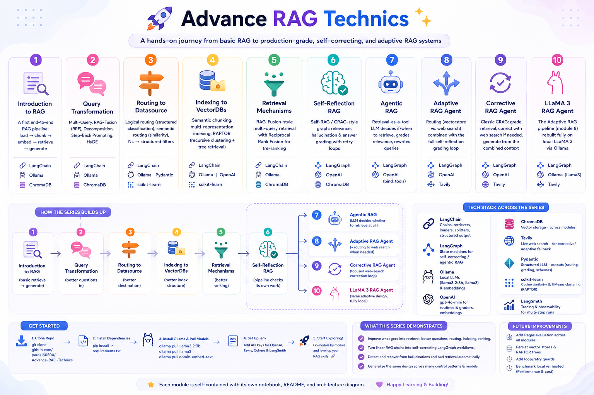

# 🚀 Advance RAG Techniques



A hands-on, notebook-by-notebook journey through **Retrieval-Augmented Generation (RAG)** — starting from a basic RAG pipeline and progressively layering on the techniques that make RAG systems production-grade: query transformation, routing, indexing strategies, self-reflection, agentic control flow, and corrective/adaptive retrieval.

Each numbered folder is a self-contained module with its own notebook, README, and (where relevant) architecture diagram — built with **LangChain**, **LangGraph**, **Ollama** (local LLMs), and **OpenAI**.

---

## 🗺️ Module Map

| # | Module | What It Covers | Stack Highlights |
|---|--------|-----------------|-------------------|
| 1 | [**Introduction to RAG**](1_Introduction_to_RAG) | A first end-to-end RAG pipeline: load → chunk → embed → retrieve → generate | LangChain · Ollama (`llama3.2:3b`) · ChromaDB |
| 2 | [**Query Transformation**](2_query_transformation) | Multi-Query, RAG-Fusion (RRF), Decomposition, Step-Back Prompting, HyDE | LangChain · Ollama · ChromaDB |
| 3 | [**Routing to Datasource**](3_routing_to_datasource.ipynb) | Logical routing (structured-output classification), semantic routing (embedding similarity), query construction (NL → structured filters) | LangChain · Ollama · Pydantic · scikit-learn |
| 4 | [**Indexing to VectorDBs**](04_Indexing_To_VectorDBs) | Semantic chunking, multi-representation indexing, RAPTOR (recursive clustering + tree retrieval) | LangChain · Ollama · OpenAI · scikit-learn |
| 5 | [**Retrieval Mechanisms**](5_retrieval_mechanisms) | RAG-Fusion-style multi-query retrieval with Reciprocal Rank Fusion for re-ranking | LangChain · Ollama · ChromaDB |
| 6 | [**Self-Reflection RAG**](6_self_reflection_rag) | Self-RAG / CRAG-style graph: relevance, hallucination & answer grading with retry loops | LangGraph · OpenAI · ChromaDB |
| 7 | [**Agentic RAG**](7_agentic_RAG) | Retrieval-as-a-tool: an LLM agent decides if/when to retrieve, grades relevance, rewrites queries | LangGraph · OpenAI (`bind_tools`) |
| 8 | [**Adaptive RAG Agent**](8_Adaptive_Rag_Agent) | Routing (vectorstore vs. web search) **combined** with the full self-reflection grading loop | LangGraph · OpenAI · Tavily |
| 9 | [**Corrective RAG Agent**](9_corrective_Rag_Agent) | Classic CRAG: grade retrieval, correct with web search if needed, generate from the combined context | LangGraph · OpenAI · Tavily |
| 10 | [**LLaMA 3 RAG Agent**](10_LLAMA_3_Rag_Agent) | The Adaptive RAG pipeline (module 8) rebuilt fully on local LLaMA 3 via Ollama | LangGraph · Ollama (`llama3`) · Tavily |

> 💡 Each module folder has its own detailed README with architecture diagrams, code walkthroughs, and key learnings — this top-level README is the map; the module READMEs are the territory.

---

## 🏗️ How the Series Builds Up

```
1. Introduction to RAG
        │  (basic retrieve → generate)
        ▼
2. Query Transformation  ──┐  (better questions in)
3. Routing                 │  (better destination)
4. Indexing                │  (better index structure)
5. Retrieval Mechanisms ───┘  (better ranking)
        │
        ▼
6. Self-Reflection RAG     (the pipeline checks its own work)
        │
        ├──► 7. Agentic RAG          (LLM decides whether to retrieve at all)
        ├──► 8. Adaptive RAG Agent   (+ routing to web search when needed)
        ├──► 9. Corrective RAG Agent (focused web-search correction loop)
        └──► 10. LLaMA 3 RAG Agent  (same adaptive design, fully local)
```

Modules 1–5 improve **what goes into retrieval** (the question, the destination, the index, the ranking). Modules 6–10 turn retrieval + generation into a **self-correcting LangGraph workflow** that can detect and recover from its own mistakes.

---

## 📦 Getting Started

### Clone the repo

```bash
git clone https://github.com/paras160500/Advance-RAG-Technics.git
cd Advance-RAG-Technics
```

### Install dependencies

A consolidated [`requirements.txt`](requirements.txt) is provided at the repo root:

```bash
pip install -r requirements.txt
```

Or install per-module as needed — each module README lists its specific dependencies (they overlap heavily: `langchain`, `langchain-community`, `langchain-core`, `langgraph`, `chromadb`, `python-dotenv`, `langsmith`).

### Install Ollama (for local-LLM modules: 1, 2, 3, 4, 5, 10)

```bash
# Download from https://ollama.com, then:
ollama pull llama3.2:3b
ollama pull llama3
ollama pull nomic-embed-text
```

### Set up environment variables

Most modules expect a `.env` file (per-folder or at the repo root) with some subset of:

```env
OPENAI_API_KEY=your_openai_api_key
TAVILY_API_KEY=your_tavily_api_key
COHERE_API_KEY=your_cohere_api_key
LANGCHAIN_TRACING_V2=true
LANGCHAIN_ENDPOINT=https://api.smith.langchain.com
LANGCHAIN_API_KEY=your_langsmith_api_key
```

- `OPENAI_API_KEY` is required for modules **6–9** (OpenAI-only) and used for embeddings in **4, 8, 9, 10**.
- `TAVILY_API_KEY` is required for the web-search fallback in modules **8, 9, 10**.
- `LANGCHAIN_*` enables optional [LangSmith](https://smith.langchain.com) tracing — useful for inspecting multi-step LangGraph runs.

---

## ⚡ Tech Stack Across the Series

- **LangChain** — chains, retrievers, document loaders, text splitters, structured output
- **LangGraph** — state machines for self-correcting / agentic RAG (modules 6–10)
- **Ollama** — local LLMs (`llama3.2:3b`, `llama3`) and embeddings (`nomic-embed-text`)
- **OpenAI** — `gpt-4o-mini` for graders/routers/generators, `OpenAIEmbeddings` for vector stores
- **ChromaDB** — vector storage across nearly every module
- **Tavily** — live web search for corrective/adaptive fallback
- **Pydantic** — structured LLM outputs (routing decisions, grading scores, query schemas)
- **scikit-learn** — cosine similarity (semantic routing) and KMeans clustering (RAPTOR)
- **LangSmith** — optional tracing/observability

---

## 🧠 What This Series Demonstrates

- Naive RAG (embed question → retrieve → generate) breaks down on vague, compound, or out-of-domain questions — **query transformation** and **routing** address this before retrieval ever happens.
- Retrieval quality is bounded by **how the index itself is built** — chunking strategy and document representation matter as much as the retriever.
- A **linear chain** has no way to recover from bad retrieval or hallucinated answers — turning the pipeline into a **graph with feedback loops** (LangGraph) is what enables self-correction.
- The same self-correcting design generalizes across very different control patterns: a fixed grading pipeline (Self-Reflection RAG), an LLM-driven agent with tool-calling (Agentic RAG), a routed multi-source pipeline (Adaptive RAG), a narrower correction-only loop (Corrective RAG), and a fully local open-weight rebuild (LLaMA 3 RAG Agent).

---

## 🚀 Future Improvements

- Add quantitative evaluation (e.g. [Ragas](https://github.com/explodinggym/ragas): faithfulness, context precision/recall, answer relevancy) across all modules for an apples-to-apples comparison
- Persist vector stores and RAPTOR trees instead of rebuilding them on every run
- Add loop/retry guards across all self-correcting graphs to prevent indefinite cycling
- Benchmark local (Ollama/LLaMA 3) vs. hosted (OpenAI) performance on the same routing/grading tasks

---

## 👨‍💻 Author

Built for learning: Advanced RAG techniques with LangChain, LangGraph, Ollama, and OpenAI.

[GitHub: paras160500/Advance-RAG-Technics](https://github.com/paras160500/Advance-RAG-Technics)
